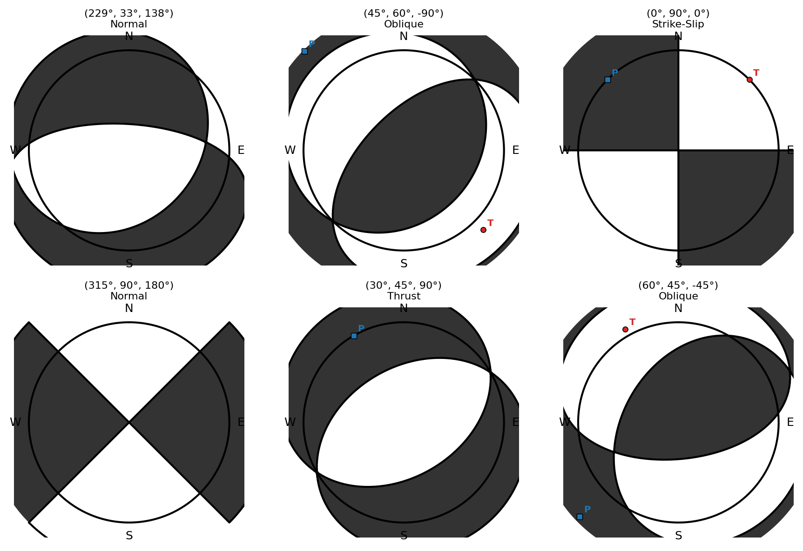

# TensorStress

**Computational Stress Tensor Analysis · Coulomb Failure Stress · Physics-Constrained ML**

[](https://python.org)
[](https://xgboost.readthedocs.io)
[](https://github.com/HiChat-fog/TensorStress/actions)
[](LICENSE)

A domain-neutral toolkit for stress tensor computation, Coulomb failure analysis, and physics-constrained ensemble regression. Designed for computational geomechanics but applicable to any stress-field modeling problem.

<p align="center">
  
</p>

---

## Why This Exists

Stress tensor analysis typically requires either expensive finite-element solvers or opaque legacy Fortran codes. TensorStress provides:

1. **Pure Python stress computation** — analytical Okada-type models + Green's function superposition
2. **Weighted ensemble regression** — handle imbalanced targets with soft weights instead of hard filtering
3. **Physical law enforcement** — post-process ML predictions to obey known scaling laws
4. **Comprehensive model audit** — 6-dimension systematic evaluation framework

---

## Core Modules

### 1. Moment Tensor Mathematics (`moment_tensor.py`)

Fault geometry → moment tensor → basis decomposition → stress projection.

```python
from tensorstress.moment_tensor import mt_from_sdr, basis_mt_decomposition

# Strike/Dip/Rake → normalized moment tensor
mt = mt_from_sdr(strike=229, dip=33, rake=138)  # 3x3 symmetric matrix

# Decompose into 5 basis mechanisms for linear superposition
coeffs = basis_mt_decomposition(229, 33, 138)
# Any double-couple = sum(coeff_i * BASIS_MT_i)

# Beachball visualization
from tensorstress.beachball import plot_beachball, plot_beachball_grid
plot_beachball(strike=229, dip=33, rake=138)
plot_beachball_grid([(229,33,138), (45,60,-90), (0,90,0)], n_cols=3)
```

### 2. Coulomb Failure Stress (`cfs.py`)

Two computation methods:

```python
from tensorstress.cfs import analytical_stress_field, compute_cfs

# Method 1: Analytical point-source (fast, physics-based)
result = analytical_stress_field(
    magnitude=7.9, depth_km=14, strike=229, dip=33, rake=138
)
# Returns CFS on thrust/normal/strike-slip/oblique receivers + max

# Method 2: From arbitrary stress tensor (Voigt 6-component)
cfs = compute_cfs(stress_6d, receiver_strike=0, receiver_dip=90, receiver_rake=0)
```

**Key insight:** CFS = shear_stress + friction × normal_stress. Positive CFS promotes failure.

### 3. Weighted Ensemble with Physical Constraints (`weighted_ensemble.py`)

**The core innovation:** instead of discarding "noisy" zero-valued training samples, assign them soft weights to preserve their signal for correlated targets.

```python
from tensorstress.weighted_ensemble import WeightedEnsemble, make_zero_event_weights

# Target-specific weight schedule
W = make_zero_event_weights(Y_train, {
    'short_term':  {'zero_weight': 0.05, 'threshold': 0.5},   # almost ignore zeros
    'medium_term': {'zero_weight': 0.12, 'threshold': 0.5},   # partial keep
    'long_term':   {'zero_weight': 1.0,  'threshold': 0.5},   # keep all
})

ensemble = WeightedEnsemble(n_seeds=7)
ensemble.fit(X_dict, Y_train, W)
predictions = ensemble.predict(X_test)
uncertainty = ensemble.predict_with_uncertainty(X_test)
```

**Why this works:**
- Zero-valued targets often contain information for correlated targets
- Hard filtering loses this signal; soft weights retain it
- Multi-seed ensemble provides uncertainty quantification

### 4. Model Audit Framework (`audit.py`)

6-dimension systematic audit:

| Audit | Checks |
|-------|--------|
| CV Stability | 5-fold MAE ± std, weighted vs unweighted |
| Feature Importance | No single feature > 20% dominance |
| Distribution | Train/test prediction alignment |
| Edge Cases | Performance on extreme input values |
| Physical Baseline | Improvement over known scaling law |
| Ablation | Degradation when removing key features |

```python
from tensorstress.audit import ModelAuditor

auditor = ModelAuditor()
auditor.audit_cv(X, y, sample_weights=w, target_name='T1')
auditor.audit_feature_importance(X, y, feature_names, target_name='T1')
# ... run all 6 audits
auditor.summary()
```

### 5. Robust Subprocess Runner (`subprocess_runner.py`)

Run legacy Fortran/C executables with timeout, error capture, and checkpoint/resume:

```python
from tensorstress.subprocess_runner import SubprocessRunner, BatchRunner

runner = SubprocessRunner('/path/to/fortran_exe', timeout_sec=90)
batch = BatchRunner(runner, skip_existing=True)
batch.run_job(work_dir, 'input.inp', 'output.dat')
```

---

## Quick Start

```bash
git clone https://github.com/HiChat-fog/TensorStress.git
cd TensorStress
pip install -r requirements.txt
```

### Run demos (no external data needed):

```bash
# Moment tensor math & CFS computation
PYTHONPATH=. python examples/demo_moment_tensor.py

# Weighted ensemble training
PYTHONPATH=. python examples/demo_ensemble.py
```

### Demo output:

```
============================================================
1. MOMENT TENSOR FROM FAULT GEOMETRY
============================================================
Fault: strike=229 deg, dip=33 deg, rake=138 deg
Moment Tensor (normalized):
  [[0.0526  0.3590  -0.2035]
   [0.3590  -0.6639  -0.6489]
   [-0.2035  -0.6489  0.6113]]
Trace = 0.000000 (should be ~0 for double-couple)

============================================================
4. ANALYTICAL COULOMB FAILURE STRESS
============================================================
Source: M7.9, depth=14km, thrust mechanism
CFS on canonical receiver types (MPa):
  cfs_max              = +0.6912
  cfs_normal           = -0.1114
  cfs_oblique1         = +0.6912
  cfs_oblique2         = +0.2051
  cfs_strike           = +0.3163
  cfs_thrust           = +0.6406
```

---

## Architecture

```
tensorstress/
├── moment_tensor.py      # SDR→MT, basis decomposition, receiver geometry
├── beachball.py          # Focal mechanism visualization (equal-area projection)
├── cfs.py                # Analytical CFS + Green's function superposition
├── weighted_ensemble.py  # Multi-target weighted XGBoost with physical constraints
├── audit.py              # 6-dimension ML model audit framework
├── subprocess_runner.py  # Robust Fortran/C subprocess management
└── __init__.py

examples/
├── demo_moment_tensor.py # Pure math demo (zero dependencies beyond numpy)
└── demo_ensemble.py      # Weighted ensemble demo with synthetic data

tests/
└── test_moment_tensor.py # 13 tests covering MT math and CFS computation
```

---

## Key Design Principles

1. **Zero external data**: all demos and tests run with synthetic data only
2. **Separation of concerns**: math, ML, and I/O are cleanly separated
3. **Physical consistency**: ML predictions are post-processed to obey known scaling laws
4. **Reproducibility**: deterministic seeds throughout; ensemble variance tracks uncertainty
5. **Domain neutrality**: no hardcoded domain constants; all parameters are configurable

---

## Technical Stack

| Component | Technology | Role |
|-----------|-----------|------|
| Tensor math | NumPy | Vectorized MT operations |
| CFS computation | NumPy | Analytical stress field |
| ML ensemble | XGBoost 2.x | Gradient-boosted regression |
| Cross-validation | scikit-learn | KFold, MAE metrics |
| Uncertainty | Ensemble std/min/max | Prediction intervals |

---

## License

MIT License — see [LICENSE](LICENSE) file.
